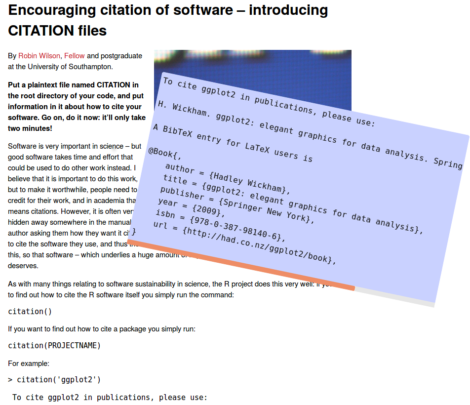
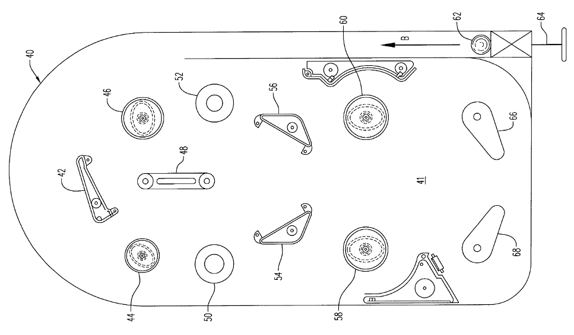
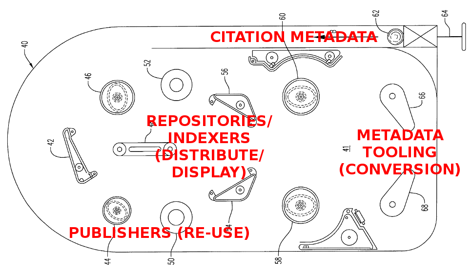
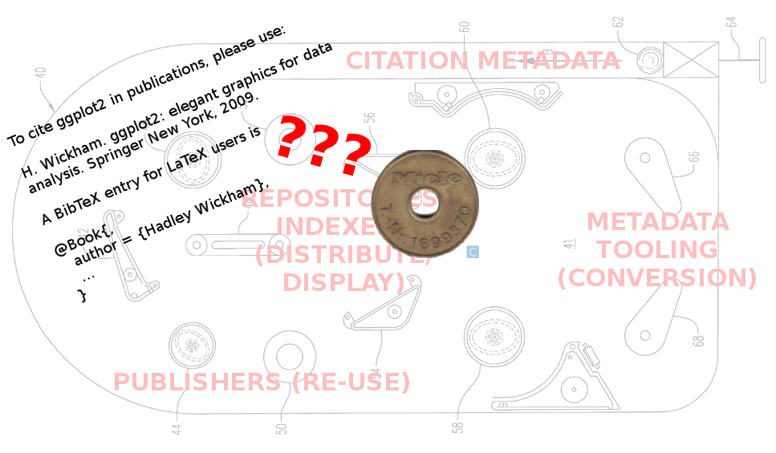
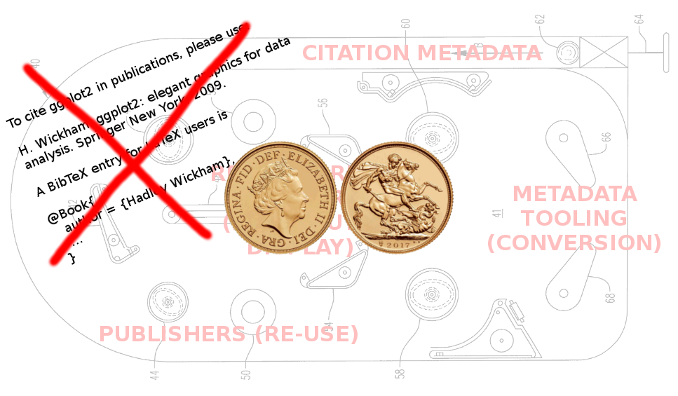
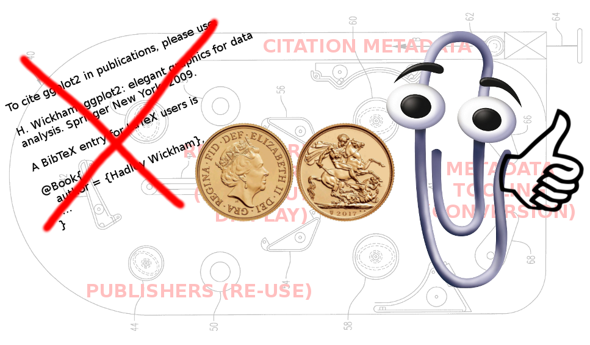

# “YOU HAVE 0 CREDIT –<br/>PLEASE INSERT <strike>COIN</strike> FILE”:<br/>The Citation File Format

Stephan Druskat

Third Conference of Research Software Engineers, University of Birmingham, Birmingham, UK, 4 September 2018.

Slides: https://sdruskat.net/citation-file-format-rse18/  

Note:
Okay, notes work! 3 blank lines = left, 2 blank lines = down.


## Who I am

#### - RSE (linguistics, digital humanities) at Humboldt-Universität zu Berlin
#### - [FORCE11 Software Citation Implementation Working Group](https://www.force11.org/group/software-citation-implementation-working-group)

ORCID: [0000-0003-4925-7248](https://orcid.org/0000-0003-4925-7248)

Email: stephan.druskat@hu-berlin.de

Twitter: [@stdruskat](https://twitter.com/stdruskat)

GitHub: [@sdruskat](https://github.com/sdruskat)


# - What is the Citation File Format (CFF)?  
# - Why should you use it?


# What is CFF?
## A format for CITATION files
### (CITATION files contain software citation metadata)


# CITATION files - what for?

### - Papers usually contain their own citation metadata
### - <i style="color: red;">Software usually doesn't</i>


# Solution

## Software must provide its own citation metadata
<br/><br/>
### - How? <i style="color: green;">In a CITATION file!</i>
### - Where? <i style="color: green;">In the source code repository root!</i>


Wilson, Robin: "Encouraging citation of software – introducing CITATION files". SSI blog. <http://bit.ly/SSI-blog-citation-files>.



```txt
To cite ggplot2 in publications, please use:

H. Wickham. ggplot2: elegant graphics for data 
analysis. Springer New York, 2009.

A BibTeX entry for LaTeX users is

@Book{,
   author = {Hadley Wickham},
   ...
 }
```


# And that's all you need!

# <span class="fragment fade-in">(If you're a human)</span>

# <span class="fragment fade-in">(And want to "just cite a software")</span>


# Software citation isn't just humans citing software in papers

















# What is CFF *exactly*?
### A *machine-readable* format for CITATION files


```yaml
cff-version: 1.0.3
message: "If you use this software, cite it as below."
authors:
  - family-names: Druskat
    given-names: Stephan
    orcid: "https://orcid.org/0000-0003-4925-7248"
title: "My Research Tool"
version: 1.0.4
doi: "10.5281/zenodo.1234"
date-released: 2017-12-18
```


```yaml
cff-version: 1.0.3
message: "If you use this software, cite it as below."
authors:
  - family-names: Druskat
    given-names: Stephan
    orcid: "https://orcid.org/0000-0003-4925-7248"
    affiliation: "Humboldt Berlin, Dept. of ..."
    email: mail@sdruskat.net
    website: https://hu.berlin/sdruskat
title: My Research Tool
...
```


```yaml
cff-version: 1.0.3
message: "If you use this software, cite it as below."
...
repository-code: https://github.com/sdruskat/mrt
repository-artifact: https://hu.berlin/nexus/mrt
license: Apache-2.0
url: https://sdruskat.github.io/my-research-tool
keywords:
  - "McAuthor's algorithm"
  - deeply confusional neural network
```


```yaml
message: "Please cite MRT AND the outline paper." ...
references:
  - type: article
    scope: Cite this for general concepts of MRT.
    authors:
      - family-names: Doe
        given-names: Jane
    title: "A 100% accuracy parser for all languages"
    year: 2099
    journal: Journal of Hard Science Fiction
    volume: 42
    issue: "13"
    doi: "10.9999/hardscifi-lang.42132"
```


# Why I want you to try CFF

### - CFF enables correct citation of software
### - CFF enforces [Software Citation Principles](https://peerj.com/articles/cs-86/)
### - CFF is human-readable and -writable
### - CFF is self-documenting (CITATION.cff, message)
### - CFF is compatible with downstream formats


# How to use CFF
### 1. Copy and paste the example from the [CFF homepage](https://citation-file-format.github.io)
### 2. Replace details with your own


# Tooling

- Getting started: [**CFF initializer**](https://citation-file-format.github.io/cff-initializer-javascript/) (Jurriaan Spaaks)
- **Tools for conversion, creation, manipulation, etc.** in different programming languages available: <https://github.com/citation-file-format/>
- **Software Citation Central Station** (SoCCS), development in progress, check back after the CFF Hack Day on Wednesday 5 Sep


# What have we learned?

1. ### Machine-readable CITATION files are needed to harness the software citation workflow from the start
2. ### The Citation File Format is suitable, and provides further features
3. ### You should try it **NOW** and add a file to your software
<li class="fragment dae-in"><h3>It's got nothing to do with pinball really</h3></li>


# Thanks!

**Contributors:** 
James W. Baker, 
Radovan Bast, 
Neil Chue Hong, 
Michael R. Crusoe, 
Morane Gruenpeter,
Robert Haines, 
Tom Klaver, 
Alexander Konovalov, 
David McKain, 
Joseph T. Parker, 
Andrew Rowley, 
Raniere Silva, 
Jurriaan H. Spaaks, 
Stefan Verhoeven

**Early CFF adopters:** The Netherlands eScience Center

**RSE18 Mentoring Programme:** Neil Chue Hong 

**The Software Sustainability Institute** for funding assistance (EPSRC, BBSRC, ESRC Grant EP/N006410/1)


# Resources

- Citation File Format website: <https://citation-file-format.github.io/>
- Citation File Format GitHub org: <https://github.com/citation-file-format/>